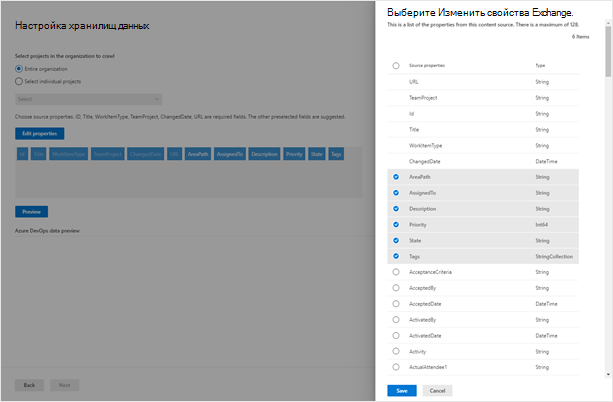

# Соединитель Azure DevOps

С помощью соединителя Azure DevOps организация может индексировать рабочие элементы в своем экземпляре службы DevOps Azure. После настройки соединителя и индексирования содержимого из Azure DevOps пользователи могут выполнять поиск этих элементов в Microsoft Search.

Эта статья предназначена для администраторов Microsoft 365 или пользователей, которые настраивают, запускают и осуществляют мониторинг соединителя Azure DevOps. В этой статье объясняется, как настроить возможности соединителя и соединителя, ограничения и способы устранения неполадок.

>[!IMPORTANT]
>Соединитель Azure DevOps поддерживает только облачную службу DevOps Azure. Azure DevOps Server 2019, TFS 2018, TFS 2017, TFS 2015 и TFS 2013 не поддерживаются этим соединителем.

## Подключение к источнику данных

Чтобы подключиться к экземпляру Azure DevOps, вам потребуется имя [Организации](https://docs.microsoft.com/azure/devops/organizations/accounts/create-organization) Azure DEVOPS, идентификатор своего приложения и секрет клиента для проверки подлинности OAuth.

### Регистрация приложения

Необходимо зарегистрировать приложение в Azure DevOps, чтобы приложение Microsoft Search могло получить доступ к экземпляру. Чтобы узнать больше, ознакомьтесь с документацией по Azure DevOps о том, как [зарегистрировать приложение](https://docs.microsoft.com/azure/devops/integrate/get-started/authentication/oauth?view=azure-devops#register-your-app).

В следующей таблице приведены указания по заполнению регистрационной формы приложения:

 **Обязательные поля** | **Описание**      | **Рекомендуемое значение**
--- | --- | ---
| Название организации         | Это название вашей компании. | Использование подходящего значения   |
| Имя приложения     | Это уникальное значение определяет приложение, для которого выполняется авторизация.    | Поиск (Майкрософт)     |
| Веб-сайт приложения  | Это обязательное поле — это URL-адрес приложения, которое будет запрашивать доступ к экземпляру Azure DevOps во время установки соединителя.  | <https://gcs.office.com/>                |
| URL-адрес обратного вызова авторизации        | Обязательный URL-адрес обратного вызова, на который перенаправляется сервер проверки подлинности. | <https://gcs.office.com/v1.0/admin/oauth/callback>|
| Разрешенные области | Это область доступа для приложения | Выберите следующие области: удостоверение (чтение), рабочие элементы (чтение), группы переменных (чтение), проект и Рабочая группа (чтение), Graph (чтение)|

При регистрации приложения с помощью описанных выше сведений вы получите **идентификатор приложения** и **секрет клиента** , которые будут использоваться для настройки соединителя.

>[!NOTE]
>Чтобы отозвать доступ к любому приложению, зарегистрированному в Azure DevOps, перейдите к разделу Параметры пользователя в правой верхней части экземпляра Azure DevOps. Щелкните профиль, а затем щелкните элемент проверки подлинности в разделе Безопасность боковой панели. Наведите указатель мыши на Авторизованное приложение OAuth, чтобы увидеть кнопку отозвать в углу сведений о приложении.

### Параметры подключения

После регистрации приложения Microsoft Search в Azure DevOps вы можете выполнить шаг параметров подключения. Введите название организации, идентификатор приложения и секрет клиента.

## Выбор проектов и полей

Вы можете выбрать подключение для индексирования всей организации или конкретных проектов.

Если вы решили индексировать всю организацию, элементы для всех проектов в организации будут индексироваться. Новые проекты и элементы будут индексироваться во время следующего обхода контента после их создания. При выборе отдельных проектов будут индексироваться только рабочие элементы в этих проектах.

Затем выберите поля, которые будут индексироваться и предварительно просматривать данные в этих полях перед тем, как продолжить.

## Управление схемой поиска

Настройте сопоставление схемы поиска. Вы можете выбрать свойства, которые будут доступны для **запроса**, **поиска** и **извлечения**.

## Управление разрешениями поиска

В настоящее время соединитель Azure DevOps поддерживает только разрешения **на поиск, видимые всем пользователям**. Индексированные данные будут отображаться в результатах поиска для всех пользователей.

## Настройка расписания обновления

Соединитель Azure DevOps поддерживает расписания обновления для полных и добавочных обходов контента. Полный обход контента находит удаленные рабочие элементы, которые ранее были синхронизированы с индексом поиска Майкрософт. Полный обход контента выполняется для синхронизации всех рабочих элементов. Чтобы синхронизировать новые рабочие элементы и обновления с существующими рабочими элементами, необходимо запланировать добавочные обходы контента.

Рекомендуемое расписание составляет один час для добавочного обхода и один день для полного обхода.
