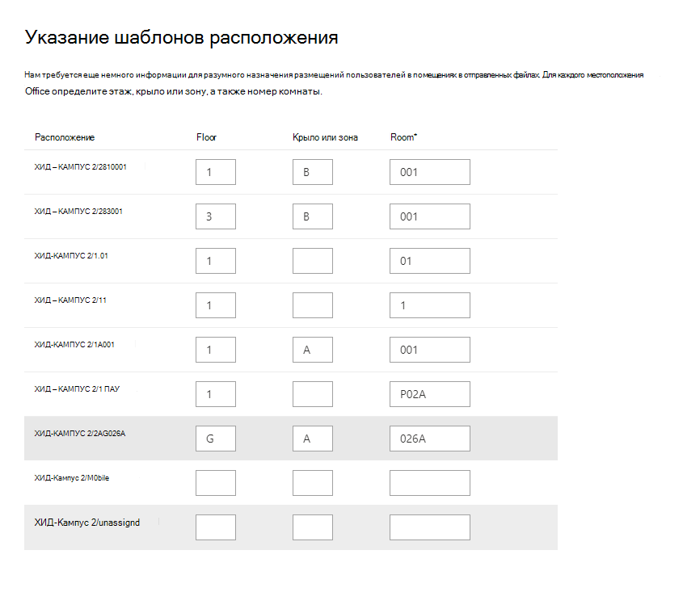
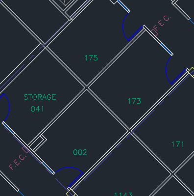

# Управление планами этажей

Планы этажей в **Microsoft Search** помогают пользователям находить людей и комнаты для собраний в рамках здания. В планах этажей ответьте на следующие вопросы:

- Где находится Office Аллан?
- Строительство 2 этажа 3
- Поиск 2/11173

## Добавление планов этажей

Выполните указанные ниже действия, чтобы настроить ответы на планы этажей в **Microsoft Search**.

### Шаг 1: определение кодов здания

Коды построения используются в качестве части расположения Office пользователя. Эти коды используются при обновлении профилей пользователей. Предположим, у вашей организации есть здание в этом расположении: *здание 2, 350 5 в, Нью — Москва, нью 10016*

Вот несколько хороших примеров для кода этого здания: 2, B2, Building2, здание 2 или NYCB2. У каждого здания должен быть уникальный код.

### Шаг 2: Ознакомьтесь с планами этажей

Файлы планов этажей должны иметь формат DWG; Файлы DWG могут содержать текстовые метки. Когда текстовая подпись отмечает комнату, она называется меткой комнаты. Файл DWG должен содержать **по крайней мере 10 комнат** , помеченных метками. Ниже приведено несколько примеров файлов DWG с различными типами меток:

|**Текстовые метки, включая метки комнат**|**Текстовые метки без меток комнат**|**Без текстовых меток**|
|:-----:|:-----:|:-----:|
||||

Сведения о просмотре и обновлении файлов DWG содержатся в разделе [вопросы и ответы](#frequently-asked-questions) .

### Шаг 3: обновление расположений Office в профилях пользователей

Расположение комнаты пользователя — это сочетание кода здания и комнаты. Например, если код здания равен *2* , а метка комнаты — *1173*, расположение офиса будет *2/1173*.

Добавьте или обновите расположения Office для каждого пользователя в Организации. Вы можете изменить расположение Office в профиле пользователя в [центре администрирования](https://admin.microsoft.com) Microsoft 365 или изменить в локальной службе Active Directory для синхронизации с Azure Active Directory. *Фисикалделиверйоффиценаме* это поле, используемое для расположения Office. Если метки комнат не включают номера этажей, ознакомьтесь со статьей "вопросы и ответы".

В этом примере Аллан Office находится в комнате 1173 на этаже 1 здания 2.

> [!NOTE]
> Чтобы просмотреть обновленные расположения Office при поиске планов этажей, необходимо обновить расположения Office по **крайней мере на 10 человек** на каждом этаже.

### Шаг 4: Проверка расположения офиса

Используйте **Microsoft Search** для поиска пользователя и проверки правильности его расположения в офисе. Если вы только что обновили расположения, вам может потребоваться подождать до **72 часов** , чтобы обновления отображались в результатах поиска.

### Шаг 5: Добавление строительных расположений

В планах этажей используются [расположения](manage-locations.md) для определения зданий. В [центре администрирования](https://admin.microsoft.com)Microsoft 365 перейдите к разделу **Параметры**  >  **поиска ответов Microsoft Search**  >  **Answers**  >  [**Locations**](https://admin.microsoft.com/Adminportal/Home#/MicrosoftSearch/locations)и нажмите кнопку **Добавить**. Введите имя, адрес и ключевые слова для здания. Добавьте столько зданий, сколько необходимо.

Дополнительные сведения о расположениях в разделе [Manage Locations](manage-locations.md)

### Шаг 6: сбор и организация расположений Office

Прежде чем вы сможете использовать планы этажей, необходимо индексировать расположения Office. Это одноразовая операция, для выполнения которой может потребоваться до 48 часов. Общее время будет зависеть от размера организации.

В [центре администрирования](https://admin.microsoft.com)откройте раздел **Параметры**  >  **Microsoft Search**  >  **вопросы и ответы**на  >  [**основания**](https://admin.microsoft.com/Adminportal/Home#/MicrosoftSearch/floorplans), а затем выберите **начать работу**. Если вы не видите это уведомление, это действие уже завершено для Организации

### Шаг 7: Загрузка планов этажей

1. В [центре администрирования](https://admin.microsoft.com)перейдите к разделу **Параметры**  >  **Microsoft Search**  >  **вопросы**и  >  [**планы этажей**](https://admin.microsoft.com/Adminportal/Home#/MicrosoftSearch/floorplans).
2. Выберите построение в раскрывающемся списке и нажмите кнопку **Далее**. Если здания нет в списке, вернитесь и [добавьте здания](#step-5-add-building-locations).
3. Выберите команду **отправить файлы**, а затем выберите план этажа, который вы отправляете.
4. После завершения отправки необходимо ввести номер этажа, представленный в файле плана этажа. Нажмите кнопку **Далее**.
5. Необязательно Если у вашего пола есть Вингс или зоны, введите этот сведения.
6. Откроется экран рецензирования, в котором показано, сколько расположений Office сопоставлено с планами этажей. Нажмите кнопку **сведения** , чтобы убедиться в правильности сопоставления.
    - Если не сопоставлено ни одного пользователя или вы не удовлетворены сопоставлением, нажмите кнопку **продолжить сопоставление**. Чтобы опубликовать, нажмите кнопку **Пропустить и опубликовать**.
7. Введите код здания для этого плана этажей. Код построения можно найти в свойстве местонахождения Office для пользователей. Например, если расположение Office пользователя — **2/1173**, то код здания равен **2**.
8. На экране проверки повторите шаг 6, чтобы убедиться в правильности сопоставления.
9. Необязательно Просмотрите и определите шаблоны расположения для всех передаваемых планов, а затем нажмите кнопку **Далее**.
10. На экране проверки повторите шаг 6, чтобы убедиться в правильности сопоставления.
11. Когда вы будете готовы, нажмите кнопку **опубликовать** , чтобы сделать план этажа доступным в **Microsoft Search**.

> [!NOTE]
> **Для публикации планов этажей требуется 48 часов.** После того, как пользователи увидят план этажа, похожий на приведенный ниже, при поиске в офисе для совместного работника.

### Шаг 8: (необязательно) укажите шаблоны расположения

После отправки плана этажа текстовые метки будут сравниваться с расположениями Office в профилях пользователей. При наличии менее 10 совпадений отображается экран **Укажите шаблоны расположения** . Шаблоны расположений используются для извлечения сведений о этаже, крыло и помещении из мест в офисе.

Требуется только комната, пол и крыло необязательны, и при необходимости вы можете пропустить их.

## Изменение планов этажей

Чтобы обновить существующий план этажа, выберите план этажа, который требуется изменить, а затем нажмите кнопку **изменить**. Внесите изменения и сохраните их.

## Устранение неполадок

|**Шаг**|**Сообщение об ошибке**|**Тип**|**Действие**|
|:-----|:-----|:-----|:-----|
|Загрузка планов этажей|Не удается прочитать CC_1. DWG. Повторите отправку или удаление плана этажа.|Error|Повторите отправку файла. Если это не поможет, удалите файл и повторите попытку.|
|Загрузка планов этажей|Существует два файла с именами CC_1. DWG. Удалите один из них или повторите отправку с другим именем.|Error|Если имя файла является неправильным, сделайте имя файла уникальным, добавив сведения этажа или крыло, а затем снова отправьте файл. Если вы случайно добавили один и тот же файл дважды, просто удалите его.|
|Загрузка планов этажей|Данные не найдены.|Error|Проверьте файл и убедитесь, что он правильный, а затем отправьте его еще раз или удалите.|
|Загрузка планов этажей|В этом файле отсутствуют внешние ссылки. Либо отправьте CC_1_furniture. DWG, либо удалите этот файл.|Предупреждение|Отправьте файлы с внешними ссылками или удалите их.|
|Загрузка планов этажей|Не удалось прочитать номера или теги комнат в файле DWG. Удалите этот файл.|Предупреждение|Проверьте файл DWG, чтобы убедиться, что данные включены, а затем удалите файл и повторите попытку.|
|Связывание расположений комнаты|В Azure Active Directory не найдены расположения для Office. Добавьте данные о расположении в Azure Active Directory, прежде чем настраивать планы этажей.|Error|[Обновление расположений Office в профилях пользователей](#step-3-update-office-locations-on-user-profiles) |

## Вопросы и ответы

**Вопрос:** Как просматривать и редактировать файлы DWG?

**A:** Используйте любой из этих параметров для просмотра файлов DWG:

- Отправьте файл в SharePoint и откройте его.
- Откройте файл в [Microsoft Visio](https://support.office.com/article/Open-insert-convert-and-save-DWG-and-DXF-AutoCAD-drawings-60cab691-0f4c-4fc9-b775-583273c8dac5) или [Аутодеск DWG труевиев](https://www.autodesk.com/products/dwg).
- Отправьте файл в [сетевое средство просмотра Аутодеск](https://viewer.autodesk.com/).

**Вопрос:** Как добавить текстовые метки к непомеченным комнатам?

**A:** Откройте файл DWG в редакторе и [добавьте метки комнат](https://knowledge.autodesk.com/support/autocad-map-3d/learn-explore/caas/CloudHelp/cloudhelp/2019/ENU/MAP3D-Learn/files/GUID-4854F184-6279-4E0C-9487-34A4759017F6-htm.html).

**Вопрос:** Как создавать и редактировать файлы DWG в целях тестирования?

**A:** Создайте файл DWG в Microsoft Visio, Аутодеск AutoCAD или любом другом редакторе DWG. Убедитесь, что в файле отмечено 10 или больше комнат.

**Вопрос:** Каков наилучший формат текстовых меток в файлах DWG?

**A:** Для достижения лучших результатов текстовые метки должны содержать номера пола и номера комнат. В примерах ниже используется 2 или SC для построения кода.
<!-- markdownlint-disable no-inline-html -->
|Типы меток комнаты|Floor|Room|Образец текстовой метки|Местоположение офиса (создание метки кода и текста)|
|:-----|:-----|:-----|:-----|:-----|
|Содержит номер основания и комнаты|1 |173|1173|2/1173|
||21|45|21045|2/21045|
||23|Со 100 000|23 КБ|2/23 100 КБ|
||1 |G06 — 07|1G06 — 07|2/1G06-07|
||2 |1024|02.1024 a|2/02.1024 a|
||2 |1024|02.1024 a|2/02.1024 a|
||2 |105,01|2105,01|2/2105.01|
|Создает код, пол и номер комнаты|нуль|X – 11 – M – 12|2-0 – X – 11 – M – 12|2/2 -0-X-11-M-12 2-0 – X – 11 – M – 12|
||2 |128A|22128A|2/22128A 22128A|
||1 |B2 – 11|21 — B2 – 11|2/21-B2-11 21 — B2 – 11|
||2 |45|SC2045|SC/SC2045 SC2045|

**Вопрос:** Можно ли использовать файл DWG, не включающий номера этажей?

**A:** Да, Вы можете. Когда вы обновляете расположения Office в профиле Azure Active Directory пользователя, включите номер этажа в номер комнаты, даже если он отсутствует в файле DWG. После отправки файла появится экран укажите шаблоны расположения, и вы можете указать оба значения.

Например, файл DWG, включающий номера комнат, но не номера этажей, может выглядеть следующим образом:

Расположение Office в профиле пользователя должно быть 2/1175, где "2" — это код здания, "1" — это номер этажа, а "175" — номер комнаты.
