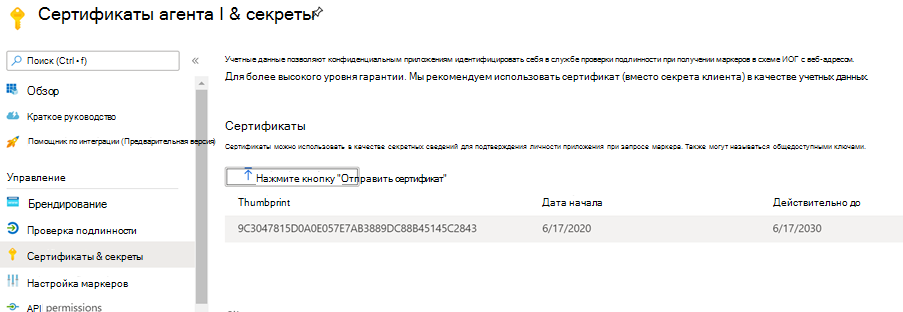

# <a name="graph-connector-agent"></a>Агент соединители Graph

Для использования подключений Graph на компьютере необходимо установить программное обеспечение агента *соединителя Graph.* Он обеспечивает безопасную передачу данных между локальной данными и API соединители Graph. В этой статье вы можете установить и настроить агент.

## <a name="installation"></a>Установка

Скачайте последнюю версию агента соединителя Graph [здесь](https://aka.ms/gcadownload) и установите программное обеспечение с помощью мастера установки. С помощью рекомендуемой конфигурации компьютера, описанного ниже, программное обеспечение может обрабатывать до трех подключений. Любые подключения, кроме этого, могут ухудшить производительность всех подключений агента.

Рекомендуемая конфигурация:

* Windows 10, Windows Server 2016 R2 и выше
* [.NET Core Desktop Runtime 3.1 (x64)](https://dotnet.microsoft.com/download/dotnet-core/3.1)
* 8 ядер, 3 ГГц
* 16 ГБ ОЗУ, 2 ГБ места на диске
* Сетевой доступ к источнику данных и Интернету через 443

Если прокси-серверы или брандмауэры организации блокируют связь с неизвестными доменами после установки агента, добавьте их в список допустимых.

1. *.servicebus.windows.net
2. *.events.data.microsoft.com
3. https://login.microsoftonline.com
4. https://gcs.office.com
5. https://graph.microsoft.com/


## <a name="create-and-configure-an-app-for-the-agent"></a>Создание и настройка приложения для агента  

Во-первых, во sign in and note that the minimum required privilege on the account is search administrator. Затем агент попросит вас предоставить сведения для проверки подлинности. Для создания приложения и создания необходимых сведений о проверке подлинности используйте следующие действия.

### <a name="create-an-app"></a>Создать приложение

1. Перейдите на портал [Azure и](https://portal.azure.com) войдите с помощью учетных данных администратора для клиента.
2. Перейдите **к регистрации приложений Azure Active Directory** в области навигации и  ->   выберите **"Новая регистрация".**
3. В качестве имени приложения выберите **"Регистрация".**
4. Заметьте ИД приложения (клиента).
5. Откройте **разрешения API** в области навигации и выберите **"Добавить разрешение".**
6. Выберите **Microsoft Graph,** а затем **разрешения приложения.**
7. Наберите в разрешениях "ExternalItem.ReadWrite.All" и "Directory.Read.All" и выберите **"Добавить разрешения".**
8. Выберите **"Предоставить согласие администратора для [TenantName]** и подтвердит, выбрав **"Да".**
9. Убедитесь, что разрешения находятся в состоянии "предоставлено".
     

### <a name="configure-authentication"></a>Настроить аутентификацию

Сведения о проверке подлинности можно предоставлять с помощью секрета клиента или сертификата. Следуйте вашим шагам.

#### <a name="configuring-the-client-secret-for-authentication"></a>Настройка секрета клиента для проверки подлинности

1. Перейдите на портал [Azure и](https://portal.azure.com) войдите с помощью учетных данных администратора для клиента.
2. Откройте **регистрацию приложения** в области навигации и перейдите к соответствующему приложению. В **области "Управление"** **выберите "Сертификаты и секреты".**
3. Выберите **новый секрет клиента** и выберите срок действия секрета. Скопируйте созданный секрет и сохраните его, так как он больше не будет показан.
4. Используйте этот секрет клиента вместе с ИД приложения для настройки агента. В поле **"Имя"** агента нельзя использовать пустые пробелы. Принимаются буквы и цифры.

#### <a name="using-a-certificate-for-authentication"></a>Использование сертификата для проверки подлинности

Существует три простых шага для использования проверки подлинности на основе сертификатов:

1. Создание или получение сертификата
1. Отправка сертификата на портал Azure
1. Назначение сертификата агенту

##### <a name="step-1-get-a-certificate"></a>Шаг 1. Получите сертификат

Сценарий ниже можно использовать для создания самозаверяемого сертификата. Ваша организация может не разрешить самозаверять сертификаты. В этом случае используйте эту информацию для понимания требований и получения сертификата в соответствии с политиками организации.

```Powershell
$dnsName = "<TenantDomain like agent.onmicrosoft.com>" # Your DNS name
$password = "<password>" # Certificate password
$folderPath = "D:\New folder\" # Where do you want the files to get saved to? The folder needs to exist.
$fileName = "agentcert" # What do you want to call the cert files? without the file extension
$yearsValid = 10 # Number of years until you need to renew the certificate
$certStoreLocation = "cert:\LocalMachine\My"
$expirationDate = (Get-Date).AddYears($yearsValid)
$certificate = New-SelfSignedCertificate -DnsName $dnsName -CertStoreLocation $certStoreLocation -NotAfter $expirationDate -KeyExportPolicy Exportable -KeySpec Signature
$certificatePath = $certStoreLocation + '\' + $certificate.Thumbprint
$filePath = $folderPath + '\' + $fileName
$securePassword = ConvertTo-SecureString -String $password -Force -AsPlainText
Export-Certificate -Cert $certificatePath -FilePath ($filePath + '.cer')
Export-PfxCertificate -Cert $certificatePath -FilePath ($filePath + '.pfx') -Password $securePassword
```

##### <a name="step-2-upload-the-certificate-in-the-azure-portal"></a>Шаг 2. Отправка сертификата на портал Azure

1. Откройте приложение и перейдите в раздел "Сертификаты и секреты" на левой области
1. Выберите "Отправить сертификат" и загрузите CER-файл
1. Откройте **регистрацию приложения** и выберите **сертификаты и секреты** в области навигации. Скопируйте отпечаток сертификата.



##### <a name="step-3-assign-the-certificate-to-the-agent"></a>Шаг 3. Назначение сертификата агенту

Если вы использовали пример сценария для создания сертификата, PFX-файл можно найти в расположении, заданного в сценарии.

1. Скачайте PFX-файл сертификата на компьютер агента.
1. Дважды щелкните PFX-файл, чтобы запустить диалоговое окно установки сертификата.
1. Выберите "Локальный компьютер" для расположения в хранилище при установке сертификата.
1. После установки сертификата откройте меню "Управление сертификатами компьютера" в меню "Пуск"
1. Выберите только что установленный сертификат в "Personal" -> 'Certificates'
1. Щелкните сертификат правой кнопкой мыши и выберите "Все задачи" -> "Управление закрытыми ключами..." Параметр
1. В диалоговом окте "Разрешения" выберите параметр "Добавить". В диалоговом окне выбора пользователя напишите : "Служба NT\GcaHostService" и нажмите кнопку "ОК". Не нажимайте кнопку "Проверить имена".
1. Нажмите кнопку "ОК" в диалоговом окте разрешений. Теперь на компьютере агента настроен агент для создания маркеров с помощью сертификата.
