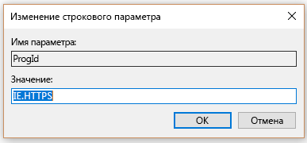

# Установка браузера по умолчанию

Настройка браузера, поисковой системы и домашней страницы по умолчанию поможет пользователям раскрыть возможности Поиска (Майкрософт), поддерживает дополнительное использование и обеспечивает удобный интерфейс.
  
Чтобы установить браузер по умолчанию для организации, следуйте указанным ниже инструкциям.
  
## Windows 8 и более поздняя версия

Чтобы установить Internet Explorer или Microsoft Edge в качестве браузера по умолчанию, выполните указанные ниже действия:
  
### Создание файла сопоставлений по умолчанию

1. Откройте административную консоль PowerShell.
    
2.  `New-Item -Path "\\$env:USERDOMAIN\SYSVOL\$env:USERDNSDOMAIN" -Type Directory -Name "Settings"`
    
3.  `$SettingsPath="\\$env:USERDOMAIN\SYSVOL\$env:USERDNSDOMAIN\Settings"`
    
4.  `Start-Process Dism.exe -PassThru "/Online /Export-DefaultAppAssociations:$SettingsPath\AppAssoc.xml"`
    
Эти действия создают файл сопоставлений по умолчанию в папке SYSVOL контроллера домена.
  
### Добавление или изменение файла сопоставлений по умолчанию

1. `Notepad "$SettingsPath\AppAssoc.xml"`
    
2. Измените указанные ниже записи (.htm, .html, http, https) и удалите другие записи, если они не нужны.
    
  - **Microsoft Edge**
    
     `<Association Identifier=".htm" ProgId="AppX4hxtad77fbk3jkkeerkrm0ze94wjf3s9" ApplicationName="Microsoft Edge" />`
  
     `<Association Identifier=".html" ProgId="AppX4hxtad77fbk3jkkeerkrm0ze94wjf3s9" ApplicationName="Microsoft Edge" />`
  
     `<Association Identifier="http" ProgId="AppXq0fevzme2pys62n3e0fbqa7peapykr8v" ApplicationName="Microsoft Edge" />`
    
  - **Internet Explorer**
    
     `<Association Identifier=".htm" ProgId="htmlfile" ApplicationName="Internet Explorer" />`
  
     `<Association Identifier=".html" ProgId="htmlfile" ApplicationName="Internet Explorer" />`
  
     `<Association Identifier="http" ProgId="IE.HTTP" ApplicationName="Internet Explorer" />`
  
     `<Association Identifier="https" ProgId="IE.HTTPS" ApplicationName="Internet Explorer" />`
    
3. Откройте консоль управления групповыми политиками (gpmc.msc) и перейдите к редактированию любой существующей политики или созданию новой.
    
1. Перейдите к разделу **Computer Configuration\Administrative Templates\Windows Components\File Explorer**
    
2. Дважды щелкните параметр **Set a default associations configuration file** (Задать файл конфигурации сопоставлений по умолчанию), установите для него значение **Enabled** (Включено) и введите путь к AppAssoc.xml (например, %USERDOMAIN%\SYSVOL\%USERDNSDOMAIN%\Settings\AppAssoc.xml)
    
4. Примените полученный объект групповой политики, привязав его к нужному домену.
    
Пользователи смогут сменить браузер после установки этой политики.
  
## Windows 7

1. Настройте локальный компьютер, который будет использоваться для установки объекта групповой политики.
    
1. Откройте **Панель управления\Программы\Программы по умолчанию\Задание программ по умолчанию** и установите Internet Explorer для использования по умолчанию. 
    
2. Откройте консоль управления групповыми политиками (gpmc.msc) и перейдите к редактированию любой существующей политики или созданию новой.
    
1. Перейдите к разделу **\<Computer/User\> Configuration\Policies\Preferences\Windows Settings**.
    
2. Щелкните правой кнопкой мыши **Registry\New** (Реестр\Создать) и выберите **Registry Wizard** (Мастер реестра).
    
3. В окне браузера реестра выберите **Local Computer** (Локальный компьютер) и нажмите кнопку **Next** (Далее).
    
4. Перейдите к разделу **HKEY_CURRENT_USER\Software\Microsoft\Windows\Shell\Associations\UrlAssociations\https** и выберите значение ProgId. Убедитесь, что значение выглядит как на изображении ниже: 
    
    
  
5. Перейдите к разделу **HKEY_CURRENT_USER\Software\Microsoft\Windows\Shell\Associations\UrlAssociations\https** и выберите значение ProgId. Убедитесь, что значение выглядит как на изображении ниже: 
    
    
  
3. Примените полученный объект групповой политики, привязав его к нужному домену.
    
Пользователи смогут сменить браузер после установки этой политики.