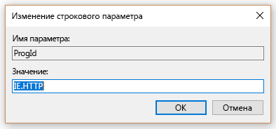

# Набор по умолчанию браузераSet default browser

Настройка браузера по умолчанию, поисковую систему по умолчанию и главной страницы по умолчанию поможет пользователям обнаружения возможностей поиска Microsoft, рекомендуем Дополнительные об использовании и предоставление облегчению интерфейса.Configuring the default browser, default search engine, and default homepage will help your users discover Microsoft Search capabilities, encourage more usage, and provide a smoother experience.
  
Чтобы задать браузера по умолчанию для вашей организации, выполните следующие действия.To set the default browser for your organization, follow the steps below.
  
## Windows 8 и вышеWindows 8 and above

Чтобы установить Internet Explorer или пограничного сервера Microsoft в качестве браузера по умолчанию, выполните следующие действия:To set Internet Explorer or Microsoft Edge as the default browser, follow these steps:
  
### Создание файла связи по умолчаниюCreate default associations file

1. Откройте консоль администрирования PowerShell.Open an administrative PowerShell console.
    
2.  `New-Item -Path "\\$env:USERDOMAIN\SYSVOL\$env:USERDNSDOMAIN" -Type Directory -Name "Settings"`
    
3.  `$SettingsPath="\\$env:USERDOMAIN\SYSVOL\$env:USERDNSDOMAIN\Settings"`
    
4.  `Start-Process Dism.exe -PassThru "/Online /Export-DefaultAppAssociations:$SettingsPath\AppAssoc.xml"`
    
Эти действия попробуйте и создайте файл связи по умолчанию в папке SYSVOL контроллера домена.These steps try and create the default associations file in the SYSVOL folder of the domain controller.
  
### Добавление и редактирование файлов сопоставлений по умолчаниюAdd or edit the default associations file

1. `Notepad "$SettingsPath\AppAssoc.xml"`
    
2. Измените следующие записи (htm, .html, http, https) и удалить другие записи, если их не обязательно.Edit the following entries (.htm, .html, http, https), and remove other entries if they're not needed.
    
  - **Microsoft Edge****Microsoft Edge**
    
     `<Association Identifier=".htm" ProgId="AppX4hxtad77fbk3jkkeerkrm0ze94wjf3s9" ApplicationName="Microsoft Edge" />`
  
     `<Association Identifier=".html" ProgId="AppX4hxtad77fbk3jkkeerkrm0ze94wjf3s9" ApplicationName="Microsoft Edge" />`
  
     `<Association Identifier="http" ProgId="AppXq0fevzme2pys62n3e0fbqa7peapykr8v" ApplicationName="Microsoft Edge" />`
    
  - **Internet Explorer****Internet Explorer**
    
     `<Association Identifier=".htm" ProgId="htmlfile" ApplicationName="Internet Explorer" />`
  
     `<Association Identifier=".html" ProgId="htmlfile" ApplicationName="Internet Explorer" />`
  
     `<Association Identifier="http" ProgId="IE.HTTP" ApplicationName="Internet Explorer" />`
  
     `<Association Identifier="https" ProgId="IE.HTTPS" ApplicationName="Internet Explorer" />`
    
3. Откройте консоль управления групповыми политиками (gpmc.msc) и перейдите в редактирования любые существующие политики или создать новый.Open Group Policy Management Console (gpmc.msc) and switch to editing any existing policy or creating a new one.
    
1. Перейдите на **компьютере Конфигурация пользователя\Административные шаблоны\Компоненты Components\File Explorer**Navigate to **Computer Configuration\Administrative Templates\Windows Components\File Explorer**
    
2. Дважды щелкните значок **Установка файла конфигурации связи по умолчанию**, задайте для него значение **Enabled**и введите путь к AppAssoc.xml (например %USERDOMAIN%\SYSVOL\%USERDNSDOMAIN%\Settings\AppAssoc.xml)Double-click **Set a default associations configuration file**, set it to **Enabled**, and enter the path to AppAssoc.xml (for example %USERDOMAIN%\SYSVOL\%USERDNSDOMAIN%\Settings\AppAssoc.xml)
    
4. Обеспечение результирующий объект групповой Политики, путем связывания ее соответствующего домена.Enforce the resultant GPO by linking it to the appropriate domain.
    
Пользователи будут иметь возможность изменение в браузере после установки этой политики.Users will be able to change the browser after this policy is set.
  
## Windows 7Windows 7

1. Настройка локального компьютера, который будет использоваться для установки объекта групповой Политики.Configure the local machine that will be used to set the GPO.
    
1. Откройте **Элемент управления Panel\Programs\Default Programs\Set по умолчанию программы** и использовать Internet Explorer по умолчанию.Open **Control Panel\Programs\Default Programs\Set Default Programs** and set Internet Explorer as the default. 
    
2. Откройте консоль управления групповыми политиками (gpmc.msc) и перейдите в редактирования любые существующие политики или создать новый.Open Group Policy Management Console (gpmc.msc) and switch to editing any existing policy or creating a new one.
    
1. Перейдите к \*\* \<компьютера или пользователя\> параметры Configuration\Policies\Preferences\Windows\*\*.Navigate to **\<Computer/User\> Configuration\Policies\Preferences\Windows Settings**.
    
2. Щелкните правой кнопкой мыши на **Registry\New** и выберите **Мастер реестра**.Right-click on **Registry\New** and select **Registry Wizard**.
    
3. В окне браузера реестра выберите **Локальный компьютер** и нажмите кнопку **Далее**.From the Registry Browser window, select **Local Computer** and click **Next**.
    
4. Перейдите к **HKEY_CURRENT_USER\Software\Microsoft\Windows\Shell\Associations\UrlAssociations\https** и выберите значение ProgId. Убедитесь, что значение выглядит как показано ниже:Navigate to **HKEY_CURRENT_USER\Software\Microsoft\Windows\Shell\Associations\UrlAssociations\https** and select the ProgId value. Make sure the value looks like the one below: 
    
    
  
5. Перейдите к **HKEY_CURRENT_USER\Software\Microsoft\Windows\Shell\Associations\UrlAssociations\https** и выберите значение ProgId. Убедитесь в том, что значение выглядит как именно ниже:Navigate to **HKEY_CURRENT_USER\Software\Microsoft\Windows\Shell\Associations\UrlAssociations\https** and select the ProgId value. Make sure that the value looks like the one below: 
    
    
  
3. Обеспечение результирующий объект групповой Политики, путем связывания ее соответствующего домена.Enforce the resultant GPO by linking it to the appropriate domain.
    
Пользователи будут иметь возможность изменение в браузере после установки этой политики.Users will be able to change the browser after this policy is set.